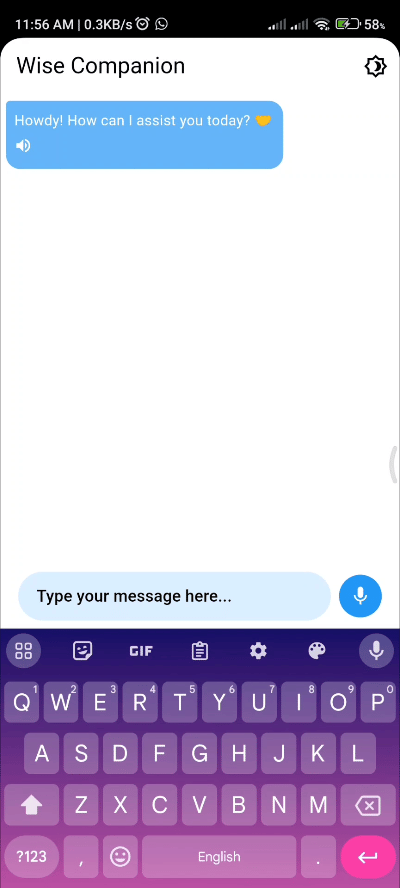

# AI Gemini App

Flutter project that leverages the Gemini AI API to create a conversational experience. It allows users to interact with a Gemini-powered chatbot using natural language.


## Features
- Light/dark mode toggle
- Custom Trained AI Model
- Speech to Text
- Text to Speech


## Demo
<table>
  <tr>
      
  </tr>
</table>


## Installation

Run my-project with flutter

```bash
  flutter pub get
  flutter run
```
    
## Environment Variables

To run this project, you will need to add the following environment variables to your .env file

`API_KEY`
## 🔗 Links
[](https://alihamza0173.github.io/)
[](https://linkedin.com/in/ali-hamza-5b3085260)

